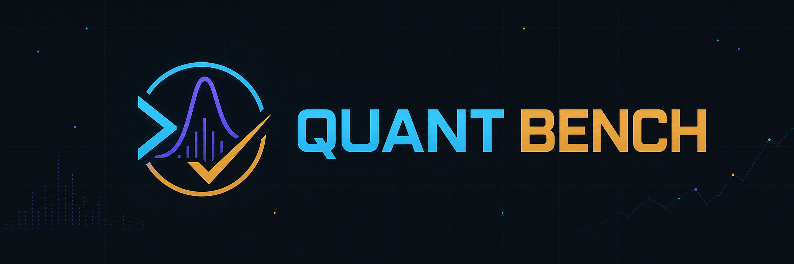
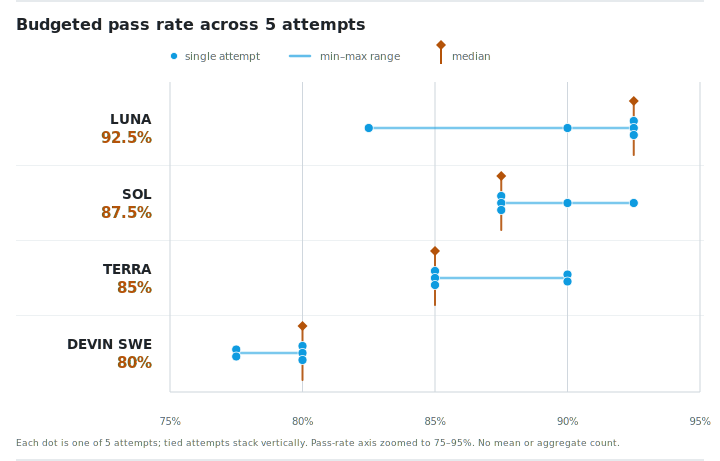

<p align="center">
  
</p>

# Quant Bench

Quant Bench is a reproducible benchmark for terminal agents performing applied
quantitative, data, and systems engineering work. The frozen `quant-terminal-v1`
suite contains 40 text-based tasks, five independent attempts per task, and
hidden deterministic verifiers.

The benchmark evaluates the complete agent-and-harness configuration (model
selector, provider, thinking setting, harness, task image, and manifest).
**It is a task benchmark, not a claim about isolated model capability.**

## Published results

The repository preserves four complete `quant-terminal-v1` result matrices.
Each matrix covers the same 40 tasks across five independent attempts, and its
preserved source runs share the historical digest declared by the publication
manifest. The public headline is the median of the five per-attempt budgeted
pass rates, rather than a pooled average.

| Agent configuration | Attempt pass rates (1→5) | Median attempt pass |
|---|---:|---:|
| OpenAI GPT 5.6 Luna — `openai-codex/gpt-5.6-luna` (`xhigh`) | 92.5%, 82.5%, 92.5%, 90.0%, 92.5% | **92.5%** |
| OpenAI GPT 5.6 Sol — `openai-codex/gpt-5.6-sol` (`max`) | 90.0%, 87.5%, 92.5%, 87.5%, 87.5% | **87.5%** |
| OpenAI GPT 5.6 Terra — `openai-codex/gpt-5.6-terra` (`xhigh`) | 90.0%, 90.0%, 85.0%, 85.0%, 85.0% | **85.0%** |
| Devin SWE 1.7 — `devin/swe-1-7` (`none`) | 80.0%, 77.5%, 77.5%, 80.0%, 80.0% | **80.0%** |

<picture>
  <source media="(prefers-color-scheme: dark)" srcset="assets/results-distribution-dark.svg">
  
</picture>

Each dot is one 40-task attempt; tied values stack vertically. The cyan line is
the observed range and the gold marker is the median. The axis is explicitly
zoomed to the observed region. Raw points are shown instead of a smoothed
density because five attempts do not support a meaningful KDE. `TIME_LIMIT`
counts as a non-pass in this summary.

- [Markdown report](results/quant-terminal-v1.md)
- [Machine-readable JSON](results/quant-terminal-v1.json)

The checked-in manifest limits the public roster to completed configurations.
The report accepts exactly the current publication digest for fresh runs or the
declared historical digest for these preserved matrices, then binds execution
to the exact configuration, Docker modes, and checked-in task image IDs.
Partial runs are not part of the published comparison.

## Quickstart

The commands below work from a fresh clone. Replace the placeholder repository
URL with the fork or mirror you intend to use.

```bash
git clone <repository-url> quant-bench
cd quant-bench
python3.11 -m venv .venv
. .venv/bin/activate
python -m pip install --upgrade pip
python -m pip install -r requirements.txt
```

Install [Bun](https://bun.sh/docs/installation) version 1.3.14 or newer, then
install [Oh My Pi (OMP)](https://github.com/can1357/oh-my-pi#readme) with the
official command:

```bash
bun install -g @oh-my-pi/pi-coding-agent
```

Supply OMP/provider credentials through OMP's normal host-side configuration.
Keep that configuration outside this checkout (the default OMP agent directory
is `~/.omp/agent`; use an external directory if you configure an override).
Never put API keys, OAuth material, provider `.env` files, `models.yml`, or
local OMP databases in the repository. The runner passes model-call capability
through a short-lived gateway; it does not mount host credentials into a task.

Run deterministic, read-only checks before any model-backed work:

```bash
python3 scripts/validate_bench_tasks.py benchmarks/quant-terminal-v1.toml
python3 scripts/quant_bench_runner.py \
  --manifest benchmarks/quant-terminal-v1.toml \
  --task-set official \
  --list-tasks
python3 scripts/bench_doctor.py \
  --manifest benchmarks/quant-terminal-v1.toml \
  --agent-execution host \
  --verifier host
```

The first command validates the manifest and public task views. The second
only lists task IDs. The final command is a host-only readiness diagnostic; it
does not establish official benchmark comparability.

## Official Docker path

Official `quant-terminal-v1` comparisons use Docker for both the agent solve and
the hidden verification phase. Build and check the locked task images before a
model-backed run:

```bash
python3 scripts/quant_bench_runner.py \
  --manifest benchmarks/quant-terminal-v1.toml \
  --task-set official \
  --build-images
python3 scripts/bench_doctor.py \
  --manifest benchmarks/quant-terminal-v1.toml \
  --require-images
```

A one-task oracle smoke is a deterministic Docker check that does not call a
model:

```bash
python3 scripts/quant_bench_runner.py \
  --manifest benchmarks/quant-terminal-v1.toml \
  --task-set official \
  --task-limit 1 \
  --attempts 1 \
  --oracle \
  --agent-execution docker \
  --verifier docker \
  --run-id quickstart-oracle
```

The full oracle and agent matrices are intentionally longer operations. Keep
all generated run data under the default `artifacts/` directory and use a
unique run ID for each invocation. Do not run model evaluations until the
validator, image checks, no-op gate, oracle smoke, and
[exact-model gateway route smoke](docs/sandbox-design.md#credential-boundary)
succeed.

## Benchmark contract

Each official run uses:

- 40 equally weighted tasks spanning data science, data engineering,
  quantitative finance, sports modeling, scientific computing, and systems;
- five independent attempts per task and agent configuration;
- the ordered task set and exact agent metadata in
  [`benchmarks/quant-terminal-v1.toml`](benchmarks/quant-terminal-v1.toml);
- one immutable Docker image per task, with CPU, memory, process, and timeout
  limits and no task network access;
- a public solve view containing only `instruction.md` and `workspace/`;
- hidden, read-only verifier files mounted only after the solve phase; and
- append-only result rows with `PASS`, `REJECT`, `TIME_LIMIT`, or
  `INFRA_BLOCKED` status.

Infrastructure failures are excluded from semantic and budgeted scores. A
`TIME_LIMIT` is a budgeted non-pass, not an infrastructure or semantic failure.
See the [benchmark design](docs/benchmark-design.md) and
[sandbox design](docs/sandbox-design.md) for the complete contract.

## Repository layout

```text
benchmarks/                    frozen manifests and image-lock data
docs/                          benchmark, sandbox, and evaluation contracts
results/                       published completed-run aggregates
scripts/quant_bench_runner.py  task runner and append-only result writer
scripts/bench_doctor.py        host and image readiness checks
scripts/bench_report.py        deterministic aggregate report generator
scripts/bench_watch.py         read-only live run dashboard
scripts/auth_gateway.py        credential-isolated OMP gateway lifecycle
scripts/gateway_socket_proxy.py exact-model request boundary
tasks/                         prompts, workspaces, images, solutions, verifiers
tests/                         harness and reporting regression tests
```

Generated run directories, gateway state, caches, logs, and local model
configuration are intentionally excluded from version control. See
[`.gitignore`](.gitignore) for the local-only paths. The root
[`requirements.txt`](requirements.txt) contains the only non-standard host
Python dependency used by the validator and gateway helpers (PyYAML).

## Reproducing a run and reporting

Use an explicit manifest, task set, agent set, run ID, execution mode, and
credential-free gateway for any agent evaluation. Candidate and task listing
commands are read-only and must not launch model requests.

For a completed run, aggregate only explicit run IDs:

```bash
python3 scripts/bench_report.py RUN_ID [RUN_ID ...] \
  --artifact-root artifacts/quant-bench-runs \
  --json-output /tmp/quant-bench-report.json \
  --markdown-output /tmp/quant-bench-report.md \
  --svg-light-output /tmp/quant-bench-results-light.svg \
  --svg-dark-output /tmp/quant-bench-results-dark.svg
```

A report is comparable only when every included configuration covers all 200
expected task-attempt cells without infrastructure failures and every source
run records a complete, non-dry Docker solve and verification with immutable
task image IDs. Keep outputs outside the repository unless they are the
intentionally published matrices; never publish a directory-wide partial
aggregate.

## Adding a task

Every promoted task owns a public prompt and fixtures, an isolated environment,
a reference solution, and a hidden verifier:

```text
tasks/<task-id>/
  README.md
  task.toml
  instruction.md
  environment/
  workspace/
  solution/
  tests/
```

The runner copies only `instruction.md` and `workspace/` into the solve view.
Task IDs are frozen because they are part of result identity. New tasks must
pass `scripts/validate_bench_tasks.py`, reject an unchanged public workspace,
pass their oracle, and keep tests, expected outputs, solutions, credentials,
and other hidden material out of the public workspace. See the
[task corpus index](tasks/README.md) for the contribution checklist.

## License

Quant Bench is available under the [MIT License](LICENSE).
